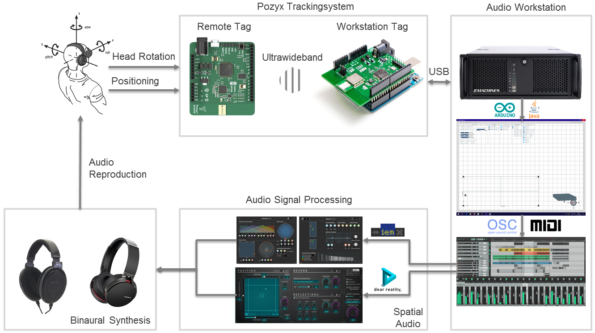
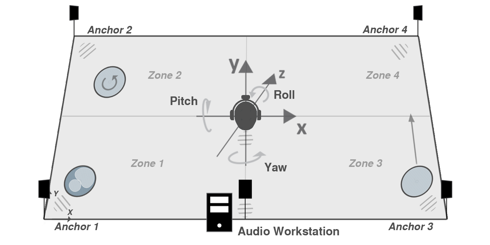
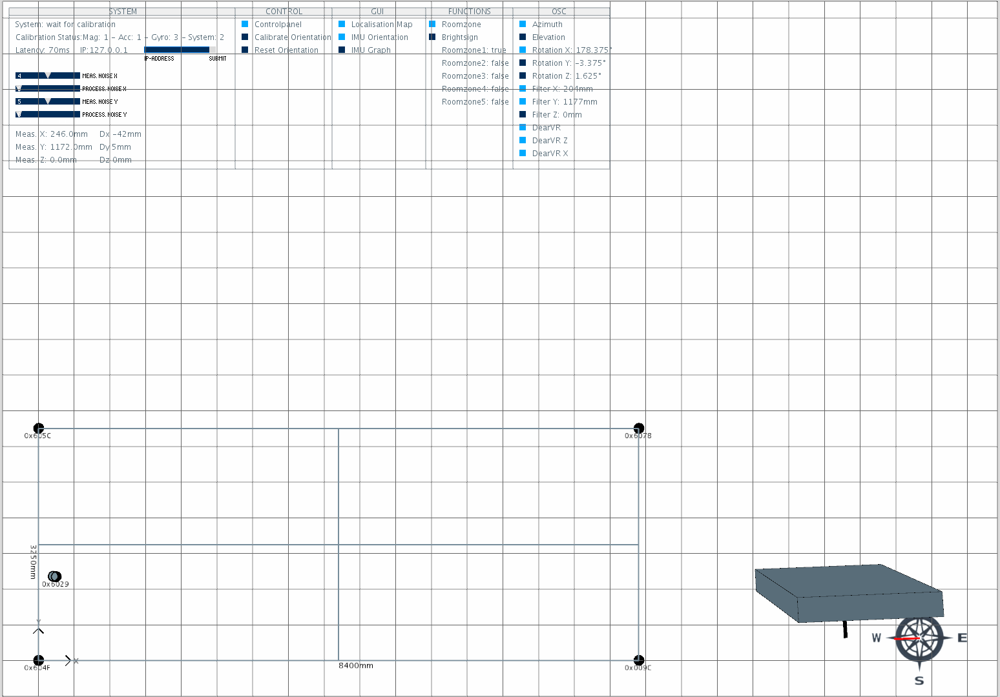

# Pozyx-spatial-audio

## concept

- extension of [Pozyx-processing](https://github.com/pozyxLabs/Pozyx-processing) to develop an interactive media installation for virtual acoustic environments
- explore spatial audio scenes with [pozyx](https://www.pozyx.io) 6dof tracking and digital audio workstation
- additional control for digital signage devices or effect lighting via osc interface
- project realization as part of bachelor thesis from sep - dec '18

## system requirements

- hardware: [pozyx creator kit](https://store.pozyx.io/product/50-001-0001-creator-kit-65) (tested FW V1.1), [arduino uno](https://store.arduino.cc/arduino-uno-rev3) & headphones
- software: [arduino ide](https://www.arduino.cc/en/software) & [processing ide](https://processing.org/download) (tested V3.54)
- digital audio workstation: [reaper](https://www.reaper.fm) (recommended, requires osc interface)
- spatial audio vst plugins: [dear vr (pro)](https://www.dear-reality.com/products/dearvr-pro), [ambix](https://github.com/kronihias/ambix), [iem plugin suite](https://plugins.iem.at/) (tu graz) or [sparta](http://research.spa.aalto.fi/projects/sparta_vsts/) (aalto university)
- overall system latency: ~70ms - blocksize 256 samples ([asio4all](http://www.asio4all.org/)), reaper and dear vr pro
- (minimum ~45ms with pozyx uwb_only tracking algorithm, but increased jitter in positioning tracking)

## software dependencies

- processing libaries: controlP5, oscP5, netP5, gwoptics
- (guidance provided in processing repository folder)

## shematics

- signal flow of positiondynamic listener tracking, audio workstation, processing interface and binaural repdroduction

- graphical system shematic of positiondynamic listener tracking with pozyx tags, anchors and spatial sound sources in controllable zones

- processing gui to control signal flow of sensor / positiong data and calibrate integrated imu on pozyx remote tag

- pozyx remote tag mounted on headphones (lipo battery powered) and workstation tag (usb powered)

