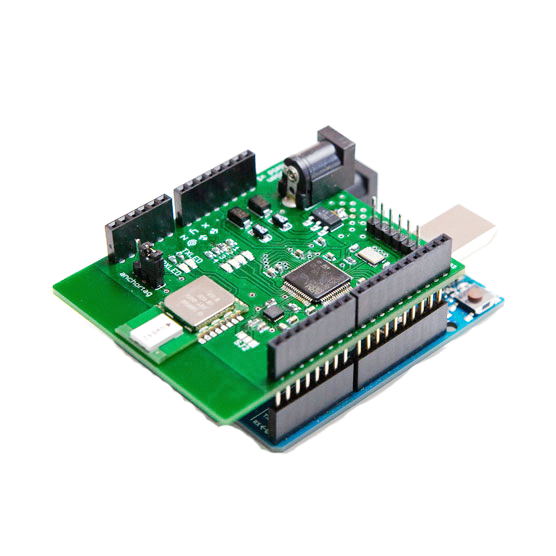
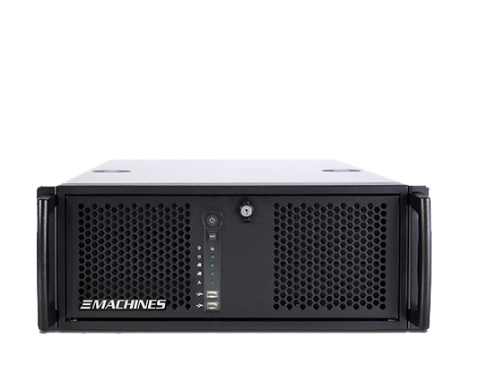

# pozyx-spatial-audio

## what it's all about

- create 6dof spatial audio enviornment with pozyx tracking
- additional control of digital signage players or effect lights via osc

## system requirements

- hardware: pozyx creator / developer kit, arduino uno
- software: arduino ide, processing ide (recommended 3.54)
- digital audio workstation: reaper (recommended, osc interface required)
- vst plugins: dear vr (pro), iem plugin suite (tu graz), sparta (aalto university)
- limitations: overall delay ~75ms - blocksize 256 samples (asio4all)
- (could be lowered to ~45ms with pozyx uwb_only tracking algorithm -> more jitter in positioning)

## software dependencies

- libaries for processing: controlP5, oscP5, netP5, gwoptics
- guide provided in processing folder

## images

