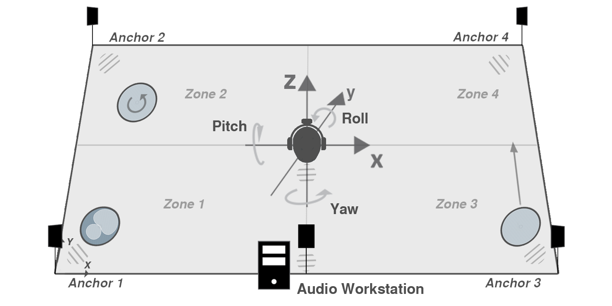

# pozyx-spatial-audio

## concept

- reproduce a 6dof spatial audio scene with [pozyx](pozyx.io) tracking and digital audio workstation
- additional control for digital signage devices or effect lighting via osc interface
- extension of [Pozyx-processing](https://github.com/pozyxLabs/Pozyx-processing) for arduino
- project realization from sep - dec '18 as part of bachelor thesis

## system requirements

- hardware: [pozyx creator kit](https://store.pozyx.io/product/50-001-0001-creator-kit-65) (tested FW V1.1), [arduino uno](https://store.arduino.cc/arduino-uno-rev3) & headphones
- software: [arduino ide](https://www.arduino.cc/en/software) & [processing ide](https://processing.org/download) (tested V3.54)
- digital audio workstation: [reaper](https://www.reaper.fm) (recommended, requires osc interface)
- spatial audio vst plugins: [dear vr (pro)](https://www.dear-reality.com/products/dearvr-pro), [ambix](https://github.com/kronihias/ambix), [iem plugin suite](https://plugins.iem.at/) (tu graz) or [sparta](http://research.spa.aalto.fi/projects/sparta_vsts/) (aalto university)
- latency limitations: overall ~75ms - blocksize 256 samples ([asio4all](http://www.asio4all.org/)), reaper and dear vr pro
- (minimum ~40ms with pozyx uwb_only tracking algorithm and increased jitter in positioning tracking)

## software dependencies

- processing libaries: controlP5, oscP5, netP5, gwoptics
- (guidance provided in processing repository folder)

## shematics

- signal flow of positiondynamic listener tracking, audio workstation, processing interface and binaural repdroduction

- graphical shematic of the system setup of positiondynamic listener tracking with pozyx tags, anchors and spatial sound sources

- processing gui to control signal flow and calibrate the pozyx system

- pozyx remote tag powered by lipo battery mounted on headphones and workstation tag 

## further development

- currently not managable
- adaption to current pozyx firm- & software
- latency comparison with python implementation
- extension for interactive media systems
