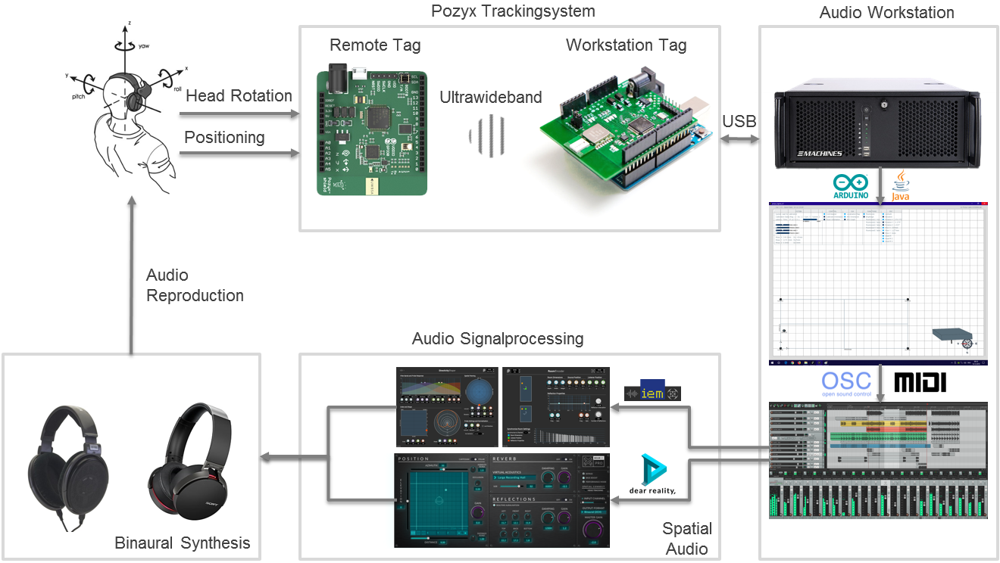

# pozyx-spatial-audio

## idea

- create 6dof spatial audio enviornment with pozyx tracking and digital audio workstation
- additional control for digital signage devices or effect lighting via osc interface
- project realization: september - december '18

## system requirements

- hardware: pozyx creator kit (tested V1.0.1), arduino uno & headphones
- software: arduino ide & processing ide (recommended 3.54)
- digital audio workstation: reaper (recommended, osc interface)
- spatial audio vst plugins: dear vr (pro), iem plugin suite (tu graz - open source) or sparta (aalto university - open source)
- latency limitations: overall delay ~75ms - blocksize 256 samples (asio4all), reaper and dear vr pro
- (minimum ~40ms with pozyx uwb_only tracking algorithm, but jitter in positioning tracking)

## software dependencies

- processing libaries: controlP5, oscP5, netP5, gwoptics
- (guidance provided in processing repository folder)

## shematics

- signal flow shematic of pozyx tracking, workstation, processing, daw, vst's and listener

- graphical shematic of the system setup with pozyx tags and anchors

- processing gui to control signal flow and calibrate the pozyx system

- pozyx remote tag with lipo mounted on headphones and workstation tag 

## further development

- currently managable
- adaption to current pozyx firm- & software
- latency comparison with python implementation
- extension for interactive media systems
